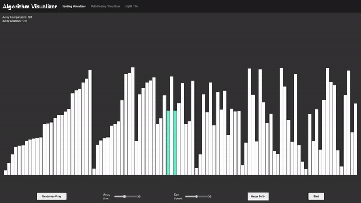
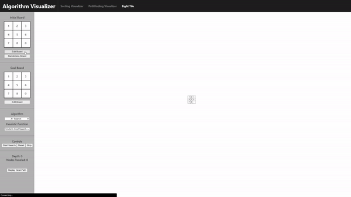

# Algorithm Visualizer

Algorithm Visualizer is a web application built utilizing ReactJS.

## Table of Contents

- [General Info](#general-info)
- [Technologies](#technologies)
- [Setup](#setup)
- [Modules](#modules)
  - [Sorting Visualizer](#sorting-visualizer)
  - [Pathfinding Visualizer](#pathfinding-visualizer)
  - [8-Tile Solver](#8-tile-solver)

## General Info

Algorithm Visualizer is inspired by the numerous visual representations of algorithm that I discovered when learning about Data Structures and Algorithms. I wanted to create a web application that would allow me to delve into web development while refining my knowledge on DSAs.

A live demo can be found here: [Algorithm Visualizer](https://derek-le1105.github.io/algorithm-visualizers/)

This web application allows you to visualize certain algorithms that would otherwise be difficult to understand without a visual representation. Certain representations include various sorting, pathfinding, and search algorithms. Each module explores the different representations; one for sorting arrays, another for path-finding within a grid, and the last one for searching puzzle states.

## Technologies

This project was created and built with:

- ReactJS
- HTML, CSS, JavaScript

## Setup

To run this project locally, install it using npm:

```
$ cd ../algorithm-visualizers-main
$ npm install
$ npm start
```

## Modules

### Sorting Visualizer



#### Features

- Array randomization
- Custom size configuration of array (up to 200 elements)
  - Double clicking the value to the right of the slider will prompt a text box to input a new desired value
- Custom speed configuration of array sorting
- Sorting algorithm selection
- Counter of array comparisons and array accesses when sorting

#### Instructions

1. Select a sorting algorithm in the dropdown menu
2. Click the 'Start' button
   - While the array is being sorting, all buttons/sliders will be disabled

> There isn't a stop/pause feature while the array is being sorted currently

### Pathfinding Visualizer


### 8-Tile Solver



#### Features

- Custom initial puzzle board configuration as well as a goal board configuration
- Puzzle board randomization that generates solvable puzzles
- Search algorithm selection
  - Heuristic selection for A Star Search algorithm
- Tree generation of all nodes traversed in goal board searching
- Goal path replay functionality

> Although the solver can find the desired goal board configuration, it should be noted that harder puzzles will generate large trees, which will make the puzzle solver difficult to navigate and use.
